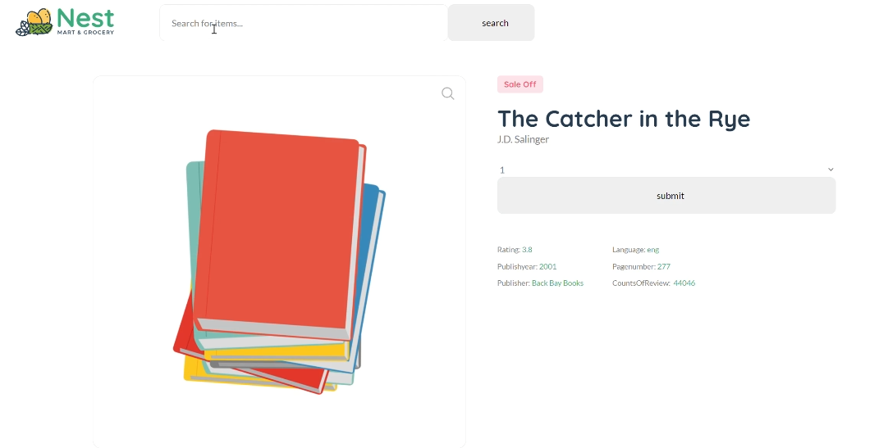

## SECTION 1 : PROJECT TITLE
## An intelligent book recommendation system

---

## SECTION 2 : EXECUTIVE SUMMARY / PAPER ABSTRACT

With the development of computer information technology and Internet technology, it has crossed from the previous era of information shortage to the era of information surplus. In this context, it is more and more difficult for people to find interesting information from many information. 

Imagine a user who wants to buy a book. Users only need to open an e-commerce bookstore and purchase directly according to the book name. The premise of this method is that users need to be clear about their needs and know exactly which book they want to buy. However, if users do not have a clear need, for example, users just want to find their favorite books, users can not tell which book it is and what it looks like. 

Currently, RecomBook will help users fulfill their needs. In the early stage of the product, it only has the recommendation function. Users need to score books on RecomBook website and make relevant recommendations according to the score. After accumulating a certain amount of user usage, the purchase or reading interface will be introduced in the middle and later stages of the product, so that users can complete the one-stop experience and facilitate the user's scoring method.

---

## SECTION 3 : CREDITS / PROJECT CONTRIBUTION

| Official Full Name  | NRIC  | 
Work Items
 | Email |
| :------------ |:---------------:| :----------------------------------| :---------------|
| Li Changwei | G****089N | Algorithm builder in Matrix Factorization, most of system design and system development work, part of the document preparation | e0703411@u.nus.edu |
| Zhao Yuchen | G****786P | Algorithm builder in Collaborative Filtering, part of front-end page, part of the document preparation | e0703449@u.nus.edu |
| Feng Yuyuan | G****718L | Sentiment analyzer, chat bot logic, part of front-end page, wish-list function, book communities cluster, promotion video, part of the document preparation | e0703334@u.nus.edu |

---

## SECTION 4 : VIDEO OF SYSTEM MODELLING & USE CASE DEMO

### [ 1 ] Video clip to promote our system

[Click here to go to the promotion video.](https://youtu.be/uU6VPHuMW1I)

### [ 2 ] Video clip to describe high level system design

[Click here to go to the system design video.](https://youtu.be/zZxO-klXF6c)

---

## SECTION 5 : USER GUIDE

`Refer to appendix <Installation & User Guide> in project report at Github Folder: ProjectReport`

### **Software requirement**

1. Mysql

2. Python environment with Django packages, if not run “pip install Django”

3. Tensorflow

 

### Install Step

1. Download the program from github:git@github.com:PFloyd0/IRS_PROJECT.git with master branch

2. Run recommendation_system/data_insert.py to install the data into mysql.

3. Run 

   > python manage.py makemigrations 
   >
   > python manage.py migrate

   in the terminal to migrate the database.

4. Run 

   > python manage.py runserver 

   to start the Django program. Click the link to go to the web.

 

### Use step

1. Register your account by click create account.

2. Give rating to several books and we can give you recommendation in the homepage.

3. You can check your cart by clicking wishlist.

4. You can check your ratings to books by clicking my.

5. You can check the detail information of book by clicking the name of book.

6. You can chat with AI robot by clicking chat.

---
## SECTION 6 : PROJECT REPORT / PAPER

`Refer to project report at Github Folder: ProjectReport`

**Sections for Project Report / Paper:**
- Abstract
- Business Case
- System Model
- System Development & Implementation
- Challenge and Conclusion
- Appendix of report: Project Proposal
- Appendix of report: Mapped System Functionalities against knowledge, techniques and skills of modular courses: MR, RS, CGS
- Appendix of report: Installation and User Guide
- Appendix of report: Individual project report per project member

---
## SECTION 7 : MISCELLANEOUS

`Refer to Github Folder: Miscellaneous`

* 
---

